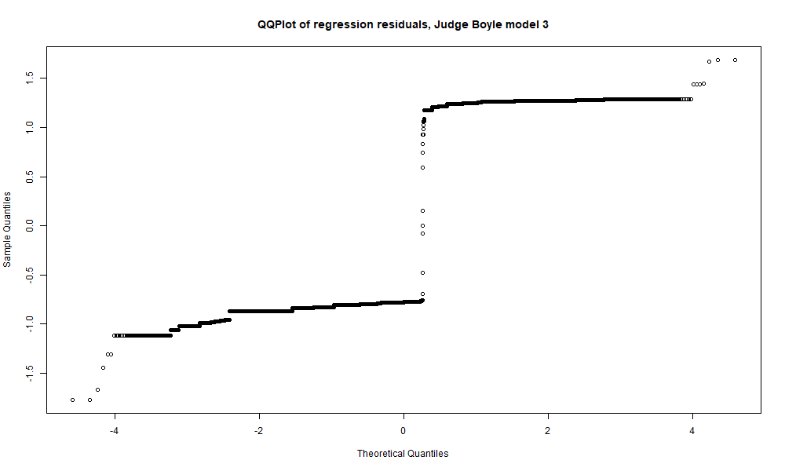

## Background
Judicial elections, like many parts of Chicago city politics, are a wonderful tool for ensuring public accountability from powerful state actors **in theory**, and (mostly) an undemocratic clusterfuck **in practice**. In case that in-depth analysis was unsatistyfing, I encourage you to check out [this article](https://www.injusticewatch.org/news/2020/why-judicial-elections-matter-and-other-common-questions-about-the-march-primary/) for more info on the politics, past and present, of judicial races (and stick around, because Injustice Watch is the best in the business when it comes to judicial reporting in Cook County).

This post is focused on only one of the many flaws in this system: the warped incentives facing judges because of a public and press that is hyperfocused on violence caused by those "let off easy". In simpler terms, the fact that as a Cook County judge you can lock up every defendant that appears before your for as long as possible and never face real retribution; but if you give the wrong defendant a second chance, you just might lose your career for it. If you don't believe me, have a look at Chicago Tribune articles that mention [judges by name](https://www.chicagotribune.com/news/ct-xpm-2013-09-25-ct-met-kass-0925-20130925-story.html). This isn't to minimize the violence done by people who'd stood in front of a judge before. But in a state that has the greatest number of years unjustly served by [exonerated individuals](https://www.law.umich.edu/special/exoneration/Pages/about.aspx), it's worth noting the disconnect here. Chicago's public and press (with obvious exceptions) has for decades been ruthless in punishing judges for the lives cut short by judicial kindness; they haven't paid much attention to the lives destroyed by judicial cruelty. 

In spring 2018, though, an opportunity arose to rectify that. Cook County State's Attorney Kim Foxx released sentencing records going back well over a decade. In a city not known for transparency, the decision to release, and continually update that data, may be the greatest legacy she leaves behind. It can be found [here](https://www.cookcountystatesattorney.org/data).

## Creating the ranking

My full methodology can be found [here](CCSAO_sentencing_analysis.html). I'll be going over the major points (and my questions) for the rest of this post. Before I go further though, I really hope others start taking a look at this data too (my code, by the way, can help with the preliminary cleaning). I think it offers a great opportunity to change the way we assess judicial impact.

The first half of my code is dedicated to creating a "severity metric". This is done by aggregating the data by judges, calculating 
1. The percent of prison sentences above the median for a given felony class (i.e. is a class 1 felony prison sentence above the median prison sentence given to a class 1 felony, etc...).
2. The percent of class 4 felony sentences resulting in prison time. 

I average those two measures to create my severity metric. I drop all judges who have served on less than 500 case (I like to deal in large sample sizes; the outcomes for judges who haven't served on many cases could be misleading). From there I just abbreviated the list and ordered it to make it tidy. I export the full list of 90 judges, ranked, to a CSV you can find [here](judge_rankings.csv). Below you can see the judges included in the list who are on the ballot for retention November 3rd, with their relative rank within the list of 90 judges by my "severity metric".

<table><table style="text-align:center"><tr><td colspan="5" style="border-bottom: 1px solid black"></td></tr><tr><td style="text-align:left"></td><td>Judges</td><td>% prison/jail sentences above median</td><td>% Class 4 felonies sentenced to prison/jail</td><td>Severity metric</td></tr>
<tr><td colspan="5" style="border-bottom: 1px solid black"></td></tr><tr><td style="text-align:left">3</td><td>URSULA WALOWSKI</td><td>0.505</td><td>0.670</td><td>0.588</td></tr>
<tr><td style="text-align:left">24</td><td>Araujo, Mauricio</td><td>0.522</td><td>0.559</td><td>0.540</td></tr>
<tr><td style="text-align:left">25</td><td>Byrne, Thomas</td><td>0.537</td><td>0.538</td><td>0.538</td></tr>
<tr><td style="text-align:left">28</td><td>William Raines</td><td>0.347</td><td>0.712</td><td>0.529</td></tr>
<tr><td style="text-align:left">38</td><td>Kenneth J Wadas</td><td>0.458</td><td>0.572</td><td>0.515</td></tr>
<tr><td style="text-align:left">55</td><td>Anna Helen Demacopoulos</td><td>0.489</td><td>0.481</td><td>0.485</td></tr>
<tr><td style="text-align:left">64</td><td>Shelley Sutker-Dermer</td><td>0.411</td><td>0.502</td><td>0.456</td></tr>
<tr><td style="text-align:left">70</td><td>Kerry M Kennedy</td><td>0.352</td><td>0.534</td><td>0.443</td></tr>
<tr><td style="text-align:left">75</td><td>Steven G Watkins</td><td>0.367</td><td>0.496</td><td>0.431</td></tr>
<tr><td colspan="5" style="border-bottom: 1px solid black"></td></tr></table>

Again, for full ranking, see the csv above.

## Checking significance

A ranking is one thing, but for context we want to see if the judges at the top of our ranking do seem to hand down “severe” sentences at a significant rate. Otherwise, the differences we see in the variables that make up our severity metric (percent of prison sentences “above the median” and percent of class 4 felony sentences resulting in prison time) could just be statistical noise.

Two years ago, when I was only looking at Judge Maura Slattery Boyle, I did this by “bootstrapping”, i.e. resampling data with replacement. My logic was that doing it this way I wouldn’t have to assume the distribution of the statistic (in this case, the two aforementioned variables). I could draw a 95% confidence interval around the variables for Judge Slattery Boyle, and then compare that confidence interval to the actual values of the variables in the entire population. If the bottom end of the confidence interval was above the actual value of the variable in the entire dataset (which was the case), I could say at a p-val of .05 that Judge Slattery-Boyle’s sentences weren’t randomly picked from the population at large. In other words, she was sentencing at a higher rate than the “average” judge.

In retrospect, this approach wasn’t particularly elegant or effective. I didn’t want to do a simple linear regression because I was dealing with two dummy variables, and the distribution of the regression residuals wouldn’t be even close to normal. My understanding then (and now, although I’d love if someone could walk me through this like I was 5) was that while non-normal residuals don’t violate the Gauss-Markov theorem, they did make it impossible to interpret the t statistics/p-values produced, and the p-value was all I really wanted.

Looking back now, I’ve had a change of heart for two reasons. 
1. As long as the Gauss-Markov assumptions are satisfied (we can adjust for heteroskedasticity using robust standard errors), the coefficient produced by my linear regression is still BLUE and consistent, meaning that given the massive sample size offered by this data (well over 100k cases), I feel more comfortable interpreting the coefficient than I did then. 
2. The biggest concern I always had was omitted variable bias, and by using a linear regression to assess significance I’m able to control for two additional variables that I didn’t account for in my bootstrap method: sentence date (as a continuos variable, assuming sentences have gotten more lenient over time) and sentence years (as fixed effects, assuming sentencing norms/rules might change year to year).

So, below I have five regression tables for five judges: Maura Slattery Boyle (still leading by my severity metric, and I want to see if controlling for the additional covariates changes the results for her), Ursula Walowski, Mauricio Araujo, Thomas Byrne, and William Raines (all up for retention and in the top third of judges by sentencing severity). Each table has three columns for three dependent variables

1. Dummy variable for sentence being above the median (0 if not, 1 if so, only using sentences that resulted in prison or jail time)
2. Dummy variable for sentence being a class 4 felony and resulting in prison time (0 if class 4 felony sentenced to probation, 1 if class 4 felony sentenced to prison or jail, only using sentences on class 4 felonies where the outcome was prison or jail)
3. Dummy variable for a sentence being “severe” (1 if sentence is for prison or jail and “above the median” for that particular felony class OR if a sentence is for prison or jail and the charge is a class 4 felony, 0 otherwise, using all sentences resulting in prison, jail, or probation time)

**Judge Slattery Boyle**

<table>
<table style="text-align:center"><tr><td colspan="4" style="border-bottom: 1px solid black"></td></tr><tr><td style="text-align:left"></td><td colspan="3"><em>Dependent variable:</em></td></tr>
<tr><td></td><td colspan="3" style="border-bottom: 1px solid black"></td></tr>
<tr><td style="text-align:left"></td><td>Above median sentence</td><td>Class 4 prison sentence</td><td>Severe sentence</td></tr>
<tr><td style="text-align:left"></td><td>(1)</td><td>(2)</td><td>(3)</td></tr>
<tr><td colspan="4" style="border-bottom: 1px solid black"></td></tr><tr><td style="text-align:left">boyle_dummy</td><td>0.078***</td><td>0.132***</td><td>0.104***</td></tr>
<tr><td style="text-align:left"></td><td>(0.011)</td><td>(0.013)</td><td>(0.013)</td></tr>
<tr><td style="text-align:left"></td><td></td><td></td><td></td></tr>
<tr><td style="text-align:left">sentence_date</td><td>0.00002</td><td>-0.00001</td><td>0.00000</td></tr>
<tr><td style="text-align:left"></td><td>(0.00001)</td><td>(0.00002)</td><td>(0.00002)</td></tr>
<tr><td style="text-align:left"></td><td></td><td></td><td></td></tr>
<tr><td style="text-align:left">Constant</td><td>1.246***</td><td>0.013</td><td>1.048***</td></tr>
<tr><td style="text-align:left"></td><td>(0.193)</td><td>(0.018)</td><td>(0.018)</td></tr>
<tr><td style="text-align:left"></td><td></td><td></td><td></td></tr>
<tr><td colspan="4" style="border-bottom: 1px solid black"></td></tr><tr><td style="text-align:left">Observations</td><td>129,586</td><td>96,051</td><td>214,571</td></tr>
<tr><td style="text-align:left">Adjusted R2</td><td>0.002</td><td>0.004</td><td>0.001</td></tr>
<tr><td colspan="4" style="border-bottom: 1px solid black"></td></tr><tr><td style="text-align:left"><em>Note:</em></td><td colspan="3" style="text-align:right">*p<0.1; **p<0.05; ***p<0.01</td></tr>
<tr><td style="text-align:left"></td><td colspan="3" style="text-align:right">Also controlling for sentence year fixed effects</td></tr>
</table>

**Judge Walowski**

<table>
  <table style="text-align:center"><tr><td colspan="4" style="border-bottom: 1px solid black"></td></tr><tr><td style="text-align:left"></td><td colspan="3"><em>Dependent variable:</em></td></tr>
<tr><td></td><td colspan="3" style="border-bottom: 1px solid black"></td></tr>
<tr><td style="text-align:left"></td><td>Above median sentence</td><td>Class 4 prison sentence</td><td>Severe sentence</td></tr>
<tr><td style="text-align:left"></td><td>(1)</td><td>(2)</td><td>(3)</td></tr>
<tr><td colspan="4" style="border-bottom: 1px solid black"></td></tr><tr><td style="text-align:left">walowski_dummy</td><td>0.042**</td><td>0.125***</td><td>0.073***</td></tr>
<tr><td style="text-align:left"></td><td>(0.017)</td><td>(0.021)</td><td>(0.021)</td></tr>
<tr><td style="text-align:left"></td><td></td><td></td><td></td></tr>
<tr><td style="text-align:left">sentence_date</td><td>0.00002</td><td>-0.00001</td><td>0.00000</td></tr>
<tr><td style="text-align:left"></td><td>(0.00001)</td><td>(0.00002)</td><td>(0.00002)</td></tr>
<tr><td style="text-align:left"></td><td></td><td></td><td></td></tr>
<tr><td style="text-align:left">Constant</td><td>1.231***</td><td>0.015</td><td>1.029***</td></tr>
<tr><td style="text-align:left"></td><td>(0.193)</td><td>(0.018)</td><td>(0.018)</td></tr>
<tr><td style="text-align:left"></td><td></td><td></td><td></td></tr>
<tr><td colspan="4" style="border-bottom: 1px solid black"></td></tr><tr><td style="text-align:left">Observations</td><td>129,586</td><td>96,051</td><td>214,571</td></tr>
<tr><td style="text-align:left">Adjusted R2</td><td>0.002</td><td>0.004</td><td>0.001</td></tr>
<tr><td colspan="4" style="border-bottom: 1px solid black"></td></tr><tr><td style="text-align:left"><em>Note:</em></td><td colspan="3" style="text-align:right">*p<0.1; **p<0.05; ***p<0.01</td></tr>
<tr><td style="text-align:left"></td><td colspan="3" style="text-align:right">Also controlling for sentence year fixed effects</td></tr>
</table>

**Judge Araujo**

<table>
  <table style="text-align:center"><tr><td colspan="4" style="border-bottom: 1px solid black"></td></tr><tr><td style="text-align:left"></td><td colspan="3"><em>Dependent variable:</em></td></tr>
<tr><td></td><td colspan="3" style="border-bottom: 1px solid black"></td></tr>
<tr><td style="text-align:left"></td><td>Above median sentence</td><td>Class 4 prison sentence</td><td>Severe sentence</td></tr>
<tr><td style="text-align:left"></td><td>(1)</td><td>(2)</td><td>(3)</td></tr>
<tr><td colspan="4" style="border-bottom: 1px solid black"></td></tr><tr><td style="text-align:left">araujo_dummy</td><td>0.052***</td><td>0.003</td><td>-0.027</td></tr>
<tr><td style="text-align:left"></td><td>(0.016)</td><td>(0.016)</td><td>(0.016)</td></tr>
<tr><td style="text-align:left"></td><td></td><td></td><td></td></tr>
<tr><td style="text-align:left">sentence_date</td><td>0.00002</td><td>-0.00001</td><td>0.00000</td></tr>
<tr><td style="text-align:left"></td><td>(0.00001)</td><td>(0.00002)</td><td>(0.00002)</td></tr>
<tr><td style="text-align:left"></td><td></td><td></td><td></td></tr>
<tr><td style="text-align:left">Constant</td><td>1.231***</td><td>0.015</td><td>1.034***</td></tr>
<tr><td style="text-align:left"></td><td>(0.193)</td><td>(0.018)</td><td>(0.018)</td></tr>
<tr><td style="text-align:left"></td><td></td><td></td><td></td></tr>
<tr><td colspan="4" style="border-bottom: 1px solid black"></td></tr><tr><td style="text-align:left">Observations</td><td>129,586</td><td>96,051</td><td>214,571</td></tr>
<tr><td style="text-align:left">Adjusted R2</td><td>0.002</td><td>0.003</td><td>0.001</td></tr>
<tr><td colspan="4" style="border-bottom: 1px solid black"></td></tr><tr><td style="text-align:left"><em>Note:</em></td><td colspan="3" style="text-align:right">*p<0.1; **p<0.05; ***p<0.01</td></tr>
<tr><td style="text-align:left"></td><td colspan="3" style="text-align:right">Also controlling for sentence year fixed effects</td></tr>
</table>

**Judge Byrne**

<table>
  <table style="text-align:center"><tr><td colspan="4" style="border-bottom: 1px solid black"></td></tr><tr><td style="text-align:left"></td><td colspan="3"><em>Dependent variable:</em></td></tr>
<tr><td></td><td colspan="3" style="border-bottom: 1px solid black"></td></tr>
<tr><td style="text-align:left"></td><td>Above median sentence</td><td>Class 4 prison sentence</td><td>Severe sentence</td></tr>
<tr><td style="text-align:left"></td><td>(1)</td><td>(2)</td><td>(3)</td></tr>
<tr><td colspan="4" style="border-bottom: 1px solid black"></td></tr><tr><td style="text-align:left">byrne_dummy</td><td>0.074***</td><td>-0.015</td><td>0.023</td></tr>
<tr><td style="text-align:left"></td><td>(0.015)</td><td>(0.018)</td><td>(0.018)</td></tr>
<tr><td style="text-align:left"></td><td></td><td></td><td></td></tr>
<tr><td style="text-align:left">sentence_date</td><td>0.00002</td><td>-0.00001</td><td>0.00000</td></tr>
<tr><td style="text-align:left"></td><td>(0.00001)</td><td>(0.00002)</td><td>(0.00002)</td></tr>
<tr><td style="text-align:left"></td><td></td><td></td><td></td></tr>
<tr><td style="text-align:left">Constant</td><td>1.234***</td><td>0.015</td><td>1.032***</td></tr>
<tr><td style="text-align:left"></td><td>(0.193)</td><td>(0.018)</td><td>(0.018)</td></tr>
<tr><td style="text-align:left"></td><td></td><td></td><td></td></tr>
<tr><td colspan="4" style="border-bottom: 1px solid black"></td></tr><tr><td style="text-align:left">Observations</td><td>129,586</td><td>96,051</td><td>214,571</td></tr>
<tr><td style="text-align:left">Adjusted R2</td><td>0.002</td><td>0.003</td><td>0.001</td></tr>
<tr><td colspan="4" style="border-bottom: 1px solid black"></td></tr><tr><td style="text-align:left"><em>Note:</em></td><td colspan="3" style="text-align:right">*p<0.1; **p<0.05; ***p<0.01</td></tr>
<tr><td style="text-align:left"></td><td colspan="3" style="text-align:right">Also controlling for sentence year fixed effects</td></tr>
</table>

**Judge Raines**

<table>
  <table style="text-align:center"><tr><td colspan="4" style="border-bottom: 1px solid black"></td></tr><tr><td style="text-align:left"></td><td colspan="3"><em>Dependent variable:</em></td></tr>
<tr><td></td><td colspan="3" style="border-bottom: 1px solid black"></td></tr>
<tr><td style="text-align:left"></td><td>Above median sentence</td><td>Class 4 prison sentence</td><td>Severe sentence</td></tr>
<tr><td style="text-align:left"></td><td>(1)</td><td>(2)</td><td>(3)</td></tr>
<tr><td colspan="4" style="border-bottom: 1px solid black"></td></tr><tr><td style="text-align:left">raines_dummy</td><td>-0.124***</td><td>0.161***</td><td>0.115***</td></tr>
<tr><td style="text-align:left"></td><td>(0.015)</td><td>(0.018)</td><td>(0.018)</td></tr>
<tr><td style="text-align:left"></td><td></td><td></td><td></td></tr>
<tr><td style="text-align:left">sentence_date</td><td>0.00002</td><td>-0.00002</td><td>0.00000</td></tr>
<tr><td style="text-align:left"></td><td>(0.00001)</td><td>(0.00002)</td><td>(0.00002)</td></tr>
<tr><td style="text-align:left"></td><td></td><td></td><td></td></tr>
<tr><td style="text-align:left">Constant</td><td>1.267***</td><td>0.018</td><td>1.011***</td></tr>
<tr><td style="text-align:left"></td><td>(0.193)</td><td>(0.018)</td><td>(0.018)</td></tr>
<tr><td style="text-align:left"></td><td></td><td></td><td></td></tr>
<tr><td colspan="4" style="border-bottom: 1px solid black"></td></tr><tr><td style="text-align:left">Observations</td><td>129,586</td><td>96,051</td><td>214,571</td></tr>
<tr><td style="text-align:left">Adjusted R2</td><td>0.002</td><td>0.004</td><td>0.001</td></tr>
<tr><td colspan="4" style="border-bottom: 1px solid black"></td></tr><tr><td style="text-align:left"><em>Note:</em></td><td colspan="3" style="text-align:right">*p<0.1; **p<0.05; ***p<0.01</td></tr>
<tr><td style="text-align:left"></td><td colspan="3" style="text-align:right">Also controlling for sentence year fixed effects</td></tr>
</table>

  
